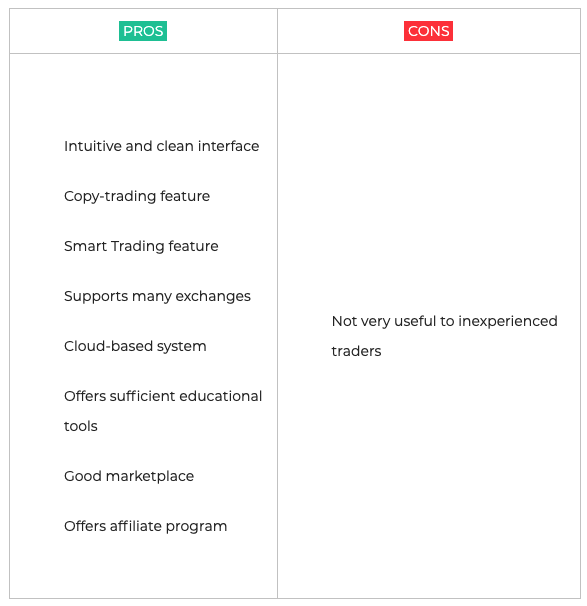
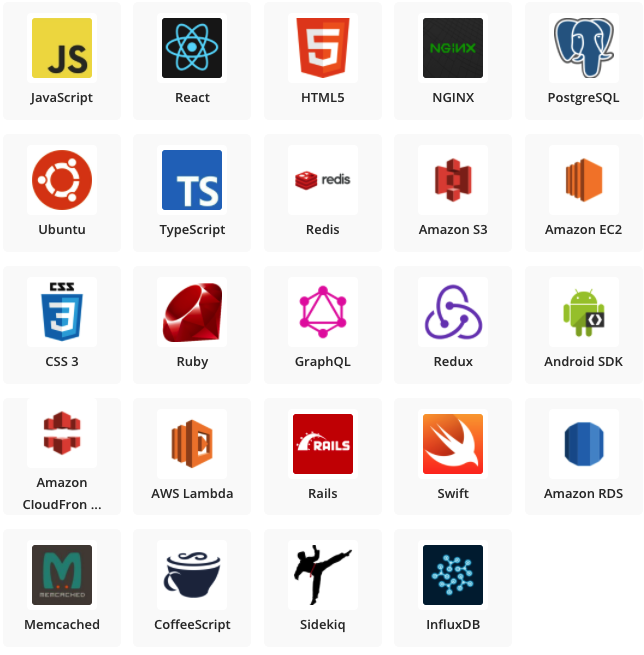
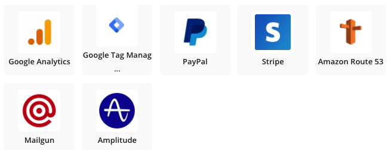
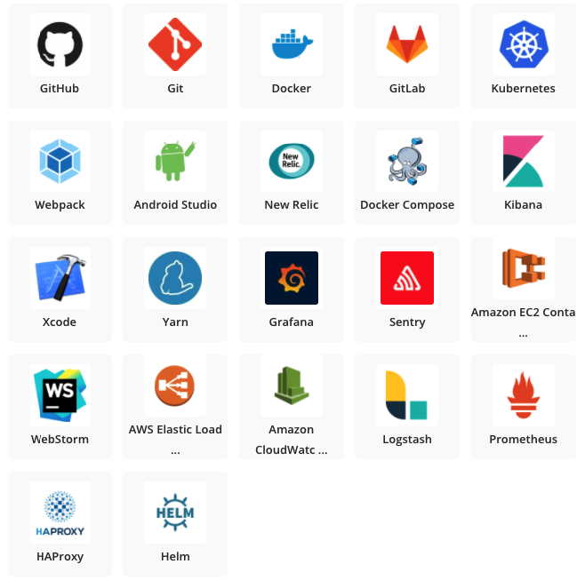

# Crypto Trading Made Easy

## About our company 

### Our goal is to make crypto trading easy with the 3Commas platform
The Founder & CEO of 3Commas Yuriy Sorokin, started to build the 3Commas platform in 2017 for their inner circle.
At that times, trading crypto directly on exchanges was challenging, because you had to constantly monitor your position in order to make any profit.
This has inspired them to build a reliable platform that can help friends within inner circle to stabilize their earnings in crypto while taking away some of the emotion
that might result in losses.
Once the power of 3Commas was realized and propel this to open further to the world of crypto outside their inner circle.

Sine launch in 2017, 3Commas cryptocurrency management platform provides access to a number of tools designed to improve overall trading efficiency and effectiveness.
The team behind the project aim to help minimize investors' risks, and limit their exposure to losses, while also maximizing their profits.

Central to the service provided is the 3Commas trading bot which operates as a web-based service and works in conjunction with a number of devices and exchanges.
The trading bots are pieces of computer software that continuously execute trades based on pre-determined parameters set by the trader.

3Commas.io is thrilled to announce its successful raise of $3M in a Series A financing round led by Alameda Research.
3Commas is a leading non-custodial, Order Management System (OMS) and crypto-asset management platform
that offers a unified access point and interface with the 23 of the world's top crypto exchanges. 3Commas provides fully automated trade 
execution and portfolio management, supported by continuously evolving strategies, algorithms, and risk management solutions allowing everyone
from the most advanced of traders to those just starting to learn, share and profit.

https://www.globenewswire.com/news-release/2020/11/03/2119400/0/en/3Commas-io-Raises-3-Million-In-Series-A-Funding-To-Democratize-Crypto-Asset-Management.html 

<!-- * When was the company incorporated?

* Who are the founders of the company?

* How did the idea for the company (or project) come about?

* How is the company funded? How much funding have they received? -->

## Business Activities:
### 3Commas helps traders win regardless of market conditions
For every market condition, there's a trading strategy that can profit from it. 
3Commas bots happen to be really good a reducing average acquisition costs, 
directly increasing your profit margins from each trade.

|Bear markets                       | Bull markets              | Sideways markets              |
|-----------------------------------|---------------------------|-------------------------------|
| Use Dollar Cost Average(DCA) bots | Use DCA Long bots to buy  | Use Grid bots to pick up      | 
| to borrow and sell tokens a the   | the natural dips and sell | cheaper tokens when they      |
| current price and buy them back   | the spikes as the price   | hit support levels and sell   |
| at a lower price.                 | rises over time, achieving| them when they're close to    |
|                                   | a better average entry    | resistance levels             |
|                                   | price for your positions  |                               |

### Crypto is hard, but 3Commas makes it easier
<b>Smart trading terminals with the ultimate feature set</b>
SmartTrade and Terminal enable you to set your trades in advanced
based on triggers you specify. Set the trade, and walk away...
3Commas will handle it.

<b>Bot presets</b>
Not sure where to start? Copy the presets from other seasoned traders and skip the learning curve.

<b>Signals</b>
Integrate signals into your bot and automatically copy the trades of professional traders

### The right tools for every kind of market and all level of traders.
|Security                       |Trade Automation               |Analytics                      |
|-------------------------------|-------------------------------|-------------------------------|
| 3Commas only interacts        | Our DCA, Grid, Options, and   | 3Commas' dasboards shows      |
| with exchanges using API      | Futures bots are proven       | you exactly how your trades   |
| keys. Your funds are          | performers that execute your  | are performing in real time   |
| secure because we do not      | trading strategy at scale. The| so you know when to optimize  |
| have your credentials and     | market never sleeps, and      | and when to let them run.      |
| cannot initiate withdrawals.   | neither do our bots.           |     

### Level up your trading game with advanced trading tools that work on 18 of the biggest exchanges.
Winning traders is the goal, and 3Commas is your all-in-one tool to achieve it. Integrating with
most any exchange, 3Commas provides you the functions you wish you had, without any risk or need to move your assets.

### Manage all your exchange accounts from one interface
Automated trading tools are supported on 18 major cryptocurrency exchanges.

### Trade automation opens up new ways to make profits
Unlike traditional stock markets, cryptocurrency markets operate 24 hours per day, 7 days per week.
This is a point of fear of manual traders, but not for 3Commas users. Your bots aren't limited
to Mon-Fri normal business hours to open deals. You can set up bots to operate under almost any
contingency, whether it's a flash crash or the market shooting to the moon. Sleep easy at night
and let bots do the work.

### Why do traders choose 3Commas compare to their competitors?
1. User-friendly interface;
2. Variety of trading bots and instruments;
3. Opportunity to feel financial freedom;
4. Great experience and cool service and customer service;
5. Helpful guides and abundance of training materials;

There are currently over 33,000 traders using the service, and the platform handles over $10m of daily trading volume.
https://blockonomi.com/3commas-review/ 

### How Does 3Commas Stand Out? https://toptradereviews.com/3commas-review/
3Commas is one of the most popular web-based crypto trading bot. As of now, there are currently 220,000 registered users and 26 supported exchanges. The platform’s main priority is user satisfaction, which is why the developers continue to add new innovative features to the bot. 3Commas users are able to track multiple orders on various exchanges and develop informed trading strategies. Recently, 3Commas has collaborated with Binance. This partnership ensures convenient trading conditions through Binance’s distinguished asset management and security infrastructure. Under the broker program, you can create a free Binance account and utilize tools from the 3commas platform. 3Commas now has a Trading Academy – this excellent compilation of resources gives users the tools they need for success. When you purchase the 3Commas Pro version, you will also receive access to a free trading course.  Since our last update about top crypto bots, 3Commas has reduced the price of all of its subscription levels.

 Pros and Cons 

### Should You Try 3Commas?https://3commas.io/blog
3Commas is an excellent cryptocurrency trading bot. It offers everything a newbie or experienced trader needs, except for arbitrage trading.

Even if you wish only to manage your portfolio or do automatic rebalancing, 3Commas is a great solution.

If you want to trade manually from one interface with boosted features, you can do it with 3Commas’ Smart Trade dashboard.

And finally, if you wish for a hands-off approach and fully automated trading, you can create your own bots: simple or composite. Or you can copy configurations of other people’s bots, buy signals from external vendors or completely copy trade best traders from 3Commas’ marketplace, you can do it all from this single interface.

### Building a Crypto Trading Bot - How to Guide
https://3commas.io/blog/how-to-build-your-own-crypto-trading-bot-guide

### Technology Stacks that powers 3Commas
<u>Application & Data </u> 

 Utilities 

 DevOps 

<!-- * What specific financial problem is the company or project trying to solve?

* Who is the company's intended customer?  Is there any information about the market size of this set of customers?

* What solution does this company offer that their competitors do not or cannot offer? (What is the unfair advantage they utilize?)

* Which technologies are they currently using, and how are they implementing them? (This may take a little bit of sleuthing–– you may want to search the company’s engineering blog or use sites like Stackshare to find this information.) -->

## Landscape:
### Cryptocurrency Trading Bot
3Commas is a trading software that sits between users and the exchange. Offering numerous innovative trading features, 3Commas allows users to build their own portfolio and custom bot which can be tested and deployed across multiple leading cryptocurrency exchanges. 

### Binance Futures Trading Bot
Binance.US is the American partner of the world’s leading cryptocurrency exchange, Binance. The original platform stopped accepting U.S. users in 2019, and instead announced it would partner with a U.S. based version. Three years later, and the exchange is inciting investor attention predominantly due to its lower fees and reputable brand.

Offering over 60 cryptocurrencies to choose from, Binance.US is recognized for its easy-to-use buy/sell option for beginners, more in-depth advanced options for professionals and discounts for high-volume traders. However, the company has been under scrutiny and regulatory pressure for it’s concerning history, in particular related to money laundering. In June 2021, the FCA banned Binance in the UK, along with Ontario (Canada), China, Europe (for derivatives trading), Malaysia, Japan and Thailand. Whilst Binance.US is available for users in the United States, not all states are included. Connecticut, Hawaii, Idaho, Louisiana, New York, Texas and Vermont are excluded. 

### 3Commas recent trends and innovations
3Commas and Unstoppable Domains Bring Innovation to Crypto Marketplace
The crypto markets have helped traders and investors make great returns. In addition to offering opportunities to deploy capital, cryptos are also helping to drive innovation. 3Commas and Unstoppable Domains both work in the crypto space, but in very different ways

Unstoppable Domains
Unstoppable Domains is software that uses blockchain technology to give the power back to the people and to ease the way people interact online.

The company uses decentralized platforms like Ethereum and Zilliqa Blockchain as a neutral 3rd party platforms instead of relying on centralized services to buy and sell domain names, such as Namecheap or GoDaddy.

It also stores the content on the InterPlanetary File System (IPFS), a decentralized hosting service, where content cannot be removed. Unstoppable Domains creates the cryptocurrency addresses to easily remember, such as a “.zil” or “.crypto” domain.

Making Cryptos Work for the Web
The company released a Google Chrome extension to give users access to .crypto domain names directly from the Chrome browser, which is currently the most-used web browser. The .crypto domains are smart contracts on the Ethereum network, meaning the overall network would have taken down when the attacker take down a site.

Unstoppable Domains Partnered with Opera Browser in March 2020, this give over 80 million users direct access to decentralized websites.

By typing .crypto domains into Opera Browser just like they would a .com domain, users will be able to view blockchain-based websites. The .crypto domain extension can be used both for cryptocurrency payments and decentralized websites.

https://3commas.io/community/c/3commas-features/14

<!-- * What domain of the financial industry is the company in?

* What have been the major trends and innovations of this domain over the last 5-10 years?

* What are the other major companies in this domain? -->

## Results
### Review
The majority of trading bots are either difficult to use, especially for new traders, or don’t operate in the way expected. 3Commas appears to have solved these problems by producing a trading bot that is both easy to set up and use and also performs reliably when compared to many of its competitors.

The system is well integrated and works on number of leading exchanges such as Binance, Coinbase, and Huobi. The 3Commas trading bot allows both novice and more experienced traders to maximize their trading potential by taking part in a twenty-four hour market without fear of any potential areas of inefficiency.

The Dashboard is easy to navigate and users are able to select a number of options with regards to configuring their trading bots, in addition there is a good amount of instructional information available, as well as detailed analytics on the bots’ performance.

Furthermore, the incorporation of features such as portfolio creation and tracking, and social trading make 3Commas a solid option for anyone interested in adding automated trading to their cryptocurrency trading protocols.

### 3Commas vs Cryptohopper: Which is The Best Crypto Trading Bot Platform in 2022?
Automated trading platforms or ‘bots’ have become a popular way to trade cryptos. Instead of having to watch the crypto markets, and look for entry and exit opportunities, crypto trading bots do most of the work. Cryptohopper and 3commas have emerged as two of the most popular trading bots in the marketplace, and they both offer great tools for trading cryptos.

Cryptohopper and 3commas offer many similar tools and both charge a fee to use their services. If you want to see a quick rundown of the similarities and differences between the two platforms, just skip down to the next section.

It is impossible to say which platform is better in an objective sense. Both Cryptohopper and 3commas give users a range of automated tools to choose from, and both will make trading crypto a lot easier.

Have a look at what Cryptohopper and 3commas do, and see if either one would make a good addition to your trading toolkit.

### Cryptohopper vs 3Commas
Cryptohopper and 3commas both work from an API key that will allow the platform to make transactions on your behalf at a number of popular crypto exchanges.

Both platforms have a lot in common and will provide the following features:

- Cloud-based platform for 24/7 connectivity
- Fee-based service
- Work with a range of crypto exchanges via an API key
- Automated trading options
- Long/short trading with limit orders
- User-friendly trading interface
- Marketplace for Purchasing third-party bots & signals

### Cryptohopper Rundown
Depending on how you choose to define a trading bot, Cryptohopper may or may not fit that definition. Cryptohopper is a great trading platform that offers advanced trading tools, as well as signaling and backtesting tools that professional traders use regularly.

Cryptohopper lets its clients use a cloud-based platform that can manage numerous crypto positions on 8 major crypto (officially supported) exchanges. The exchanges that officially support Cryptohopper are:

- KuCoin
- Binance
- Coinbase Pro
- Bittrex
- Poloniex
- Kraken
- Huobi
- Bitfinex
- Cryptohopper supports 75 tokens according to its website, so clients won’t have any trouble finding a token pair to trade.

### How Cryptohopper Works
Cryptohopper will allow its clients to use a range of semi-automated trading tools on supported exchanges. Once it is configured by a user, the Cryptohopper bot will trade automatically on exchanges with a client’s account.

The platform also features trading signals that can help you decide if you want to enter or exit a position. In addition to automated trading, Cryptohopper also has social trading functionality that will let traders work together to profit.

### Cryptohopper Tools
Cryptohopper will allow you to set up buying and selling parameters on any of the crypto exchanges that support its platform. The triggers that you decide to use can be configured to work in any market conditions, but the platform doesn’t really offer a fully automated trading algo.

Cryptohopper has the following order types/trading tools:

Trailing Stop Loss – When a position moves in your favor, it can be a good idea to use a stop loss order that adjusts itself to the market, so that some of the gains will be a sure thing. A trailing stop loss does this for you, and Cryptohopper has it as a standard feature on its platform
Searching for Targets – One of the reasons why traders use automated tools is because they simply can’t be at a trading terminal 24/7. Cryptohopper will be at every exchange, all the time, looking to open or close a position when the market moves to a level that you determine. This is extremely handy for traders who aren’t able to make trading a full-time job but have a good idea of the positions they want to take.
Reserved Funds –If you want to make sure there is always something saved-up in your account, Cryptohopper has a reserved funds tool that lets you set aside a given amount of tokens. This may or may not be a useful feature for your individual style of trading, but it is a nice tool to have available.
Scalp Trading – Scalp trading (or ‘scalping’) is a way to make money quickly off of small market movements. Cryptohopper has automated the scalping process, and the platform will scalp on your behalf along parameters you decide.
Positive Pair Trading –The trend is your friend, and Cryptohopper has created a positive pair trading tool to help find the best opportunities for making a winning trade. Cryptohopper’s positive pair tool will look for any tokens pairs that have been performing well over the last 24 hours, and enter those markets.
Triggers – The crypto markets can move quickly, and Cryptohopper’s triggers allow you to get in on the action. You can set up triggers to buy or sell short any of the tokens that Cryptohopper supports, and make a trade when the market moves in the direction you think it will take.
Short Selling – Selling a token short means that you will be able to profit from a fall in its value, and Cryptohopper has created the ability to sell a token short when a trigger point it hit. You can also set up a level where the position would be closed, and your profit locked-in.
Dollar Cost Averaging – When you buy a larger position in smaller increments, the amount that the overall position cost to buy changes. This is called dollar-cost averaging, and Cryptohopper has built a dollar-cost averaging tool into its trading platform. There are many ways to use dollar-cost averaging, and you can learn more about it on Cryptohopper’s website.
Signalers – Cryptohopper allows third-party traders to act is signalers as a part of its social trading network. You are able to see the kind of trading track record that a signaler has, and trade your tokens with them. Of course, past trading success is no guarantee of future returns, but it is a nice option if you want to use the insights of other traders to potentially profit!

### Cryptohopper Pricing
Cryptohopper has a three-tiered pricing model that also allows you to demo the lowest tier for a week at no cost.
Pioneer Plan: Free Trial for 7 Days – The Explorer hopper plan is free to use for seven days.
Explorer: Starter package ($19 Per Month) – The starter packagae will cost $19 USD per month. This plan will give you the ability to manage 80 positions chosen from up to 15 tokens, with technical analysis applied every 10 minutes. You will also be able to set-up 2 triggers with this plan.
Adventure: Trader Plus Package ($49 Per Month) –The Adventure Hopper plan is Cryptohopper’s mid-range plan, and it will cost you $49 USD per month. This plan boosts the number of positions to 200 and lets you trade in 50 different tokens. You will also get technical analysis applied every 5 minutes, and be able to use 5 triggers.
Hero: Pro Trader Package ($99 Per Month) – The Hero Hopper plan is the top-of-the-range offering from Cryptohopper. It allows you to manage up to 500 positions selected from 75 tokens. You will be able to use 10 triggers and receive technical analysis every 2 minutes, and it costs 99 USD per month. The Hero Hopper plan also adds altcoin signals to the rest of the features.
If you want to learn more about Cryptohopper, please check out our in-depth review right here.

### 3Commas The Rundown
3commas offers its clients a range of automatic trading options. Unlike Cryptohopper, 3commas does have fully automated trading bots that will operate without being configured by the client.

3commas also allows the use of simple trading tools to create custom bots, and also has simple automated trading tools for simpler trading strategies.

3commas will operate with the following crypto exchanges (supported features given according to 3commas website and reproduced verbatim):

- Bittrex (Smart Trade, Portfolios, AutoTrading Bot)
- Poloniex (Smart Trade, Portfolios)
- HitBTC (Smart Trade)
- Coinbase Pro (GDAX) (Smart Trade)
- OKEx (Smart Trade, AutoTrading Bot)
- Bitmex.com (AutoTrading Bot)
- Kraken (SmartTrade)
- Bitfinex (Smart Trade)
- Binance (Smart Trade, Portfolios, AutoTrading Bot)
- KuCoin (Smart Trade)
- Bitstamp (Smart Trade)
- Houbi Global (Smart Trade, AutoTrading Bot)
- Gate.io (SmartTrade)

As you can see, the functionality of 3commas is highly dependent on what exchanges you feel comfortable using. For a deeper look into what each of these tools allows you to do, keep on reading!

### 3Commas Tools
3commas has a flexible structure that allows traders to use mostly automatic trading bots, create automated trading sequences, or just use automated buying and selling tools.

This may be one area where 3commas is a better fit for some traders, as it has algos that are basically automatic once some simple parameters are created.

Smart Trading – The smart trading feature allows you to set up trade parameters that will be automatically executed by 3commas cloud-based platform. These tools are similar to the ones that are offered by Cryptohopper and will allow you to stay on top of the market without being lashed to a trading terminal. Both long and short trading is supported by the platform, as long as it is allowed by the exchange.
Auto Trading Bot – The Auto Trading Bot that 3commas is basically automatic. All you have to do is choose a token pair, and enter some basic trading parameters. Once the bot is active, it will work on your behalf to make profits. You can fine-tune the bot you use by choosing a long, short or composite strategy for the token pairs you want to trade, and the bot will basically do the rest.
Like everything on 3 commas, there are some variables you can tweak, and try to ramp up your gains. The composite bot tool allows you to mix long and short positions over a variety of token pairs, to take advantage of more complex trading strategies.

There is also a list of the top bots from the last 24 hours, in case you want to try and jump on a willing trend. All of these tools create the potential for profit and are almost totally automated. Of course, once you set the bot loose, you will be responsible for any losses, so starting small is probably a good idea.

### 3Commas Pricing
3commas has three plans that offer more to traders as they climb the pricing ladder. Unlike Cryptohopper, 3commas does offer a 3 day free trial if you signup for their pro plan.

The Starter Package – For $22 USD per month, 3commas will give you access to the Smart Trading terminal with no trading limits and include errors and cancelations notifications. Due to the fact that most of the crypto exchanges only support the Smart Trading terminal, this plan would probably be a good place for most traders to start.
The Advanced Package – For $37 USD per month, 3commas gives you everything from the Starter Package and adds access to simple bots, as well as personal signals provided by Trading View.
The Pro Package – The Pro Package from 3commas will set you back $75 USD per month and adds both complex and Bitmex bots to the offering, as well as full portfolio management. There are also deals for customers who sign up for longer periods of time with 3commas.
If you want to read more about 3commas, please check out our in-depth review right here.

<!-- * What has been the business impact of this company so far?

* What are some of the core metrics that companies in this domain use to measure success? How is your company performing, based on these metrics?

* How is your company performing relative to competitors in the same domain? -->

## Recommendations

I have benefited personally to get into crypto trading as a beginner. It was easy to setup and start using the trading platform on day 1.
Able to make money whilst you sleep.
Please check below and feedback for all other recommendations.

https://au.trustpilot.com/review/3commas.io

<!-- * If you were to advise the company, what products or services would you suggest they offer? (This could be something that a competitor offers, or use your imagination!)

* Why do you think that offering this product or service would benefit the company?

* What technologies would this additional product or service utilize?

* Why are these technologies appropriate for your solution? -->
